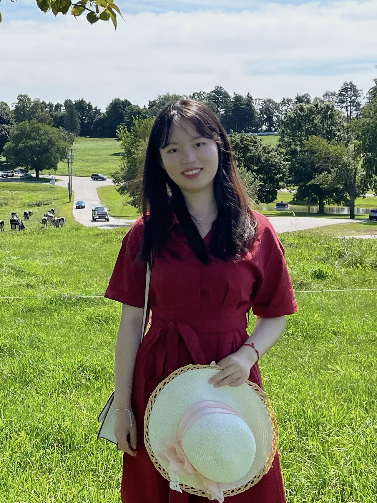

<!--  -->

Hi! I am a fifth-year Ph.D. student at the [Center for Statistical Science](http://www.stat.tsinghua.edu.cn/en), [Tsinghua University](https://www.tsinghua.edu.cn/en/), fortunate to be advised by Professor [Dong Li](http://www.stat.tsinghua.edu.cn/en/teachers/dongli/). In 2023, I visited the [Department of Statistics](https://statistics.fas.harvard.edu/home) at Harvard University for one year, and I am fortunate to be mentored by Professor [Zheng (Tracy) Ke](https://zke.fas.harvard.edu).

My primary research interests lie in the field of financial econometrics, non-linear time series analysis, network analysis, ranking inference and topic modeling. Besides, I have a broad interest in exploring the interactions of statistics with various disciplines, and considering ways in which statisticians can better contribute to the wider scientific community.

Beyond research, I also enjoy music, movies and travel.

**I am on the 2023-2024 job market.**

## Education
* Ph.D. in [Statistics](http://www.stat.tsinghua.edu.cn/en/), Tsinghua University, 2019-now.
* B.E. in [Economics](https://www.sem.tsinghua.edu.cn/en/), Tsinghua University, 2016-2019.
* B.A. in [Foreign Languages](https://www.dfll.tsinghua.edu.cn), Tsinghua University, 2015-2019.
* Science Experimental Class (top science class), [Nanjing Foreign Language School](http://www.nfls.com.cn/iynt/main.htm), 2012-2015.

## Contact
Email: taoyx19[at]mails.tsinghua.edu.cn, or taoyx19[at]gmail.com
